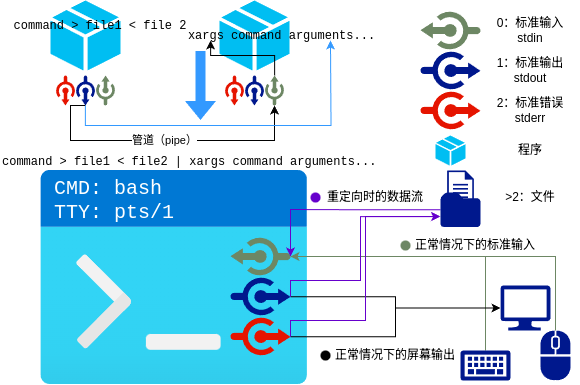

# 第二讲 命令行高级操作和 Shell 脚本编程

前置知识：无。有操作系统基础、编程语言基础者为佳。第一讲已学有帮助。

Copyright 2025 wold9168@GitHub(Shinonome Tera tanuki)
校对：OhanaTyan@GitHub

本讲主要涵盖 Shell 必知必会的高级知识（这里的高级是相对于直接使用 Shell 指令这种基础操作而言的）。

一些例如管道、文件描述符等技巧与系统内核有关，而 Shell 脚本编程的快速掌握又需要读者有编程语言的基础。因而本讲内容上完全需要单开一讲。

---

## 命令行高级操作

### 前置知识：Linux 文件描述符

文件描述符 (fd) 是一个非负整数。当进程打开一个**文件**、**管道**、**网络套接字**或**其他 I/O 资源**等资源时，Linux 内核会返回一个文件描述符给进程。这体现了 Linux 系统的“一切皆文件”理念。即便是不同类型的资源，进程也可以用相对统一的方式对它们进行操作。

每个进程都维护有自己的文件描述符列表，并用一个非负整数去索引。进程可以通过文件描述符对一个文件进行间接操作。

如果一个进程想要读写一个文件，它需要从操作系统中获取该文件的文件描述符。在每次对该文件进行读写操作时，进程需要向操作系统提供文件描述符，然后操作系统会根据文件描述符找到对应的资源，并进行读写操作。

进程启动的时候默认创建三个文件描述符：

- `0`：标准输入（`stdin`，通常接收用户从键盘的输入）
- `1`：标准输出（`stdout`，通常输出到终端屏幕）
- `2`：标准错误（`stderr`，通常默认也输出到终端屏幕）

实质上，进程在读取从键盘的输入，或者向终端输出内容时，实际上都是通过上述这三个文件描述符进行操作的。

在 Linux 系统中，当我们调用C语言的 `printf` 和 `scanf` 这类函数时，或者是调用 `fopen` 这类操作文件的函数时，实际上这些函数内部都是通过文件描述符进行操作的，只是C语言隐藏了这些细节。

### 重定向

重定向顾名思义，就是把文件描述符**重新定向**到另一个“文件”内。例如下面的例子中，本来 `echo` 指令的标准输出会输出到屏幕终端（因为本来标准输出就会输出到屏幕终端），但通过重定向，`echo` 指令的标准输出输出到了文件 `~/hello.txt` 中。

用户可以通过重定向，将 Shell 进程的输入和输出重定向到某个文件内。这是重定向比较基础的一个应用。

```bash
# 下面这一行命令会将 "Hello, World!" 输出到标准输出
echo "Hello, World!"  # 1
# 下面这一行命令会将 "Hello, World!" 输出到文件 ~/hello.txt
echo "Hello, World!" > ~/hello.txt  # 2
# 下面这一行命令会将 "123123" 追加到文件 ~/hello.txt。于是，~/hello.txt 文件的内容变为 "Hello, World!\n123123"。
echo "123123" >> ~/hello.txt # 3
# 下面这一行命令会将 "Another Hello" 输出到文件 ~/hello.txt。需要注意的是，由于 ~/hello.txt 文件已存在，所以 echo 指令的输出会覆盖掉该文件原有的内容。于是，执行下面一行命令后，~/hello.txt 文件的内容只有 "Another Hello"。
echo "Another Hello" > ~/hello.txt  # 4
```

我们来阐述上例中重定向做了什么。

```bash
echo "Hello, World!" > ~/hello.txt # echo 指令的标准输出被重定向至 ~/hello.txt。如若文件不存在，则创建之；否则，则覆盖之。
echo "123123" >> ~/hello.txt # echo 指令的标准输出被重定向至 ~/hello.txt。如若文件不存在，则创建之；否则，则将 echo 指令的标准输出追加至 ~/hello.txt 文件尾。。
echo "Another Hello" > ~/hello.txt # 因为 ~/hello.txt 文件已存在，所以 echo 指令的输出会覆盖掉该文件原有的内容
```

然后给出一个重定向标准输入的例子。

```bash
cat < ~/hello.txt
```

这个例子中，`~/hello.txt`文件的内容被输入进`cat`指令的标准输入。

从文件描述符的角度，`echo`指令会将命令行的参数输出到标准输出内，`cat`指令将文件中的内容搬运到标准输出。通过重定向，本应该输出到标准输出的内容可以被输出到其它文件，本应该从标准输入读取的内容可以从文件中读取。

重定向为命令行指令的输入输出提供了一座与文件系统，以及其他一切存在文件描述符的软件系统的桥梁。Linux 是秉持“一切皆文件”理念的操作系统，文件描述符可以在系统管理中起巨大作用，举例如下：

```bash
echo 1 > /sys/bus/pci/devices/<PCI Address>/remove # 这行指令实现的功能是——禁用一个特定 PCI 地址的 PCI 设备。
```

字符串`1`被 echo 指令输出，而 echo 指令的输出又被重定向到`/sys/bus/pci/devices/<PCI Address>/remove`这一文件。正是这一操作，使得 Linux 内核收到移除特定 PCI 设备的信息，进而实现了禁用一个特定 PCI 地址的 PCI 设备的功能。

参阅 bash(1) 的 REDIRECTION 一节以获取更多信息。

顺带一提，网络套接字也是一种文件描述符。这意味着，重定向也可以被用于向网络发送数据。

#### tty 指令和 gdb 的 tty 重定向

`tty`指令的作用是，打印连接到当前终端的标准输出的文件。

比如，打开两个终端。其中一个输入`tty`，假如其输出为`/dev/pts/0`；在另一个终端输入`echo "example" > /dev/pts/0`。我们会发现，输入`tty`的那个终端，其界面中出现`example`字样。这再次验证了《重定向》一节所言。

这个例子中，因为第一个终端的标准输出是`/dev/pts/0`，所以我们在第二个终端将`example`输出到这个文件，就等同于向第一个终端的标准输出塞入了`example`这个字符串。

`gdb`中也有一个`tty`指令，用于重定向`gdb`所调试程序的标准输出到其他终端中。其用法为：`tty <连接到其他终端的标准输入的文件>`

使用这一方法可以避免`gdb`的 TUI 被`gdb`所调试程序的标准输出搞乱。

### Shell 管道

Shell 管道干的活与重定向相近。（Linux 的管道是一个大机制，Shell 管道是这一机制的一个经典应用。）不同的是，管道是将数据从一个指令搬运到另一个指令；重定向是将数据从指令搬运到文件，或将数据从文件搬运到指令。

Shell 管道通过管道符`|`进行。管道符`|`的作用是，将前一个指令的标准输出连接到后一个指令的标准输入。

```bash
ls | wc -l # 统计当前目录下文件个数
cat system.log | grep "error" # 搜索 system.log 文件中出现 "error" 字段的行
cat data.txt | sort | uniq # 输出 data.txt 文件的内容，并排序和去重
```

### xargs

`tty`指令只暴露出终端程序的标准输出给我们操作。那么有没有办法可以使我们操作终端程序的标准输入呢？——答案是`xargs`指令。

`xargs`指令会将其后面的参数作为一条指令（临时称之为指令A）执行，并将标准输入接收到的内容作为参数传递给指令A。

举例如下：

```bash
echo file1 file2 file3 | xargs touch # 等价于 touch file1 file2 file3
echo file1 file2 file3 | xargs -i touch {} --no-create # 等价于 touch "file1 file2 file3" --no-create，-i 参数指定标准输入读入内容的占位符为 {}
echo file1 file2 file3 | xargs -I _ touch _ --no-create # 等价于 touch "file1 file2 file3" --no-create，-I 参数用于指定自定义占位符
```

### 小结



### 扩展了解：`bash`快捷键

`bash`有许多快捷键。以下介绍其默认的 Emacs 风格快捷键方案。

| 快捷键       | 功用                                                                                                 |
| ------------ | ---------------------------------------------------------------------------------------------------- |
| Ctrl+C       | 发送中断，终止终端当前命令；也可用作保存当前终端缓冲区输入于终端历史，以便修改。                     |
| Ctrl+D       | 基本用法是用 EOF 强行终止终端当前命令，与 Ctrl-C 原理不同。zsh中，若终端缓冲区有输入，则作提示之用。 |
| Ctrl+Z       | 挂起当前命令而不终止。                                                                               |
| Ctrl+L       | 清屏。                                                                                               |
| Ctrl+R       | 进入搜索模式。按下后，输入搜索内容。而后再按，向前搜索终端历史。                                     |
| Crtl+J       | 执行当前搜索结果，相当于回车，并结束搜索模式。                                                       |
| Crtl+G       | 置当前搜索结果入终端，并结束搜索模式。                                                               |
| Ctrl+P       | 终端历史中，当前指令的前一条指令。终端缓冲区有输入时，与上方向键行为不同。                           |
| Ctrl+N       | 终端历史中，当前指令的后一条指令。终端缓冲区有输入时，与下方向键行为不同。                           |
| Ctrl+A       | 置光标于行首。                                                                                       |
| Ctrl+E       | 置光标于行尾。                                                                                       |
| Ctrl+W       | 自光标处删至行首。                                                                                   |
| Ctrl+K       | 自光标处删至行尾。                                                                                   |
| Ctrl+←/Alt+B | 向后一个单词。                                                                                       |
| Ctrl+→/Alt+F | 向前一个单词。                                                                                       |

## Shell 编程

### 变量

可以按照下面的方式创建和使用变量。需要注意的是，当定义变量的时候，等号`=`的左右两边不能有空格。

```bash
example_var="123" # 定义变量
echo $example_var # 使用变量
echo ${example_var} # 使用变量，花括号可选
echo ${undefined_var} # 未定义变量，默认为空，而无报错！这个很重要，属于常有之错中极有危害性的！
readonly ro_var="123" # 只读变量
unset ro_var # 删除变量
my_array=(1 2 3 4) # 数组
echo $0 $1 $2
```

#### 环境变量

`export`命令可以将变量分享给子进程。被`export`的变量会被添加到环境变量中，子进程可以访问这些变量。

```bash
VAR=1
export VAR # 分享变量给子进程，称作环境变量
export another_var=1
```

系统环境变量一般定义在`/etc/profile`和`/etc/profile.d/`下。

用户环境变量一般定义在`~/.bashrc`（或其他 rc 文件下）和`~/.profile`（或其他 profile 文件下）下。

（如 zsh，其 rc 文件为`~/.zshrc`，其 profile 文件为`~/.zprofile`。不同 shell 所用文件不同。）

rc 文件在相应 shell 启动时应用，即，当启动 bash 时，bash 会读取`/etc/profile`和`/etc/profile.d/`下的配置文件，然后读取用户的 `~/.bashrc` 文件。

#### 特殊变量

下面的特殊变量常用于脚本编程。

- `$0`表示脚本的名称。
- `$1`、`$2`等表示脚本的参数。
- `$#`表示传递给脚本的参数数量。

使用 C 语言中编写的可执行程序中`main`函数的返回值可以被下面的特殊变量读取到。

- `$?`表示上一个命令的退出状态等。

#### 引号之分：`""`和`''`

```bash
root@ee8e51e37746:/# echo "123 \\ \$ 456" # 双引号中发生转义
123 \ $ 456
root@ee8e51e37746:/# echo '123 \\ \$ 456' # 单引号中不发生转义
123 \\ \$ 456
```

### 判断

```bash
# 无 else 格式
if condition
then
    command1
    command2
    ...
    commandN
fi

if condition; then command1;command2;...;commandN; fi

# 有 else 格式
if condition
then
    command1
    command2
    ...
    commandN
else
    commandN+1
    ...
    commandM
fi

# 有 elif 格式
if condition
then
    command1
    command2
    ...
    commandN
elif another_condition
    commandN+1
    ...
    commandM
else
    commandM+1
    ...
    commandP
fi

# case 语句
case value in
pattern1)
    command1
    command2
    ...
    commandN
    ;;
pattern2)
    command1
    command2
    ...
    commandN
    ;;
esac
```

#### 条件表达式 `condition` 的语法

```bash
test EXPRESSION
# 或
[ EXPRESSION ]  # 方括号与 EXPRESSION 必须用空格隔开
```

此处 EXPRESSION 为条件表达式。格式如下：

| 操作符             | 描述         | 示例                         |
| ------------------ | ------------ | ---------------------------- |
| -e                 | 文件是否存在 | [ -e file.txt ]              |
| -f                 | 是普通文件   | [ -f /path/to/file ]         |
| -d                 | 是目录       | [ -d /path/to/dir ]          |
| -r                 | 可读         | [ -r file.txt ]              |
| -w                 | 可写         | [ -w file.txt ]              |
| -x                 | 可执行       | [ -x script.sh ]             |
| -s                 | 文件大小 > 0 | [ -s logfile ]               |
| -L                 | 是符号链接   | [ -L symlink ]               |
| -z STRING          | 字符串为空   | [ -z "$var" ]                |
| -n STRING          | 字符串非空   | [ -n "$var" ]                |
| STRING1 = STRING2  | 字符串相等   | [ "$var1" = "$var2" ]        |
| STRING1 != STRING2 | 字符串不等   | [ "$var1" != "$var2" ]       |
| -eq                | 等于         | [ "$a" -eq "$b" ]            |
| -ne                | 不等于       | [ "$a" -ne "$b" ]            |
| -gt                | 大于         | [ "$a" -gt "$b" ]            |
| -ge                | 大于或等于   | [ "$a" -ge "$b" ]            |
| -lt                | 小于         | [ "$a" -lt "$b" ]            |
| -le                | 小于或等于   | [ "$a" -le "$b" ]            |
| !                  | 逻辑非       | [ ! -f "$file" ]             |
| -a                 | 逻辑与       | [ "$a" -eq 1 -a "$b" -eq 2 ] |
| -o                 | 逻辑或       | [ "$a" -eq 1 -o "$b" -eq 2 ] |

#### 条件表达式的`[[ ]]`和`(( ))`

`[[ ]]`：

- 支持模式匹配：`[[ "$var" == *.txt ]]`
- 支持正则表达式：`[[ "$var" =~ ^[0-9]+$ ]]`

`(( ))`：

- 专为数值比较设计：`(( a > b ))`
- 支持更复杂的算术表达式

### 循环

#### `for`循环

```bash
for var in item1 item2 ... itemN
do
    command1
    command2
    ...
    commandN
done

for var in item1 item2 ... itemN; do command1; command2… done;
```

#### `while`循环

```bash
while condition
do
    command1
    command2
    ...
    commandN
done
```

#### `continue` 和 `break`

`continue` 和 `break` 只能用于循环之中。

`continue` 跳过当前循环剩下语句。

`break` 终止循环。

当出现嵌套循环（即一个循环中包含另一个循环）时，`continue` 和 `break` 只会影响最内层的循环。

### 获取指令结果：`$()`和`` `command` ``

`$(command)` 是 shell 的一种命令替换机制。它允许我们将一个命令的输出作为另一个命令的参数或者赋值给变量。`` `command` `` 与其等价。

```bash
echo $(echo 123 456)
# 相当于
echo `echo 123 456`
# 相当于
echo 123 456
```

这个例子中，括号内部的 `echo 123 456`命令的输出结果是`123 456`，于是`$(echo 123 456)`的输出结果也是`123 456`。那么，在括号内部的内容执行完毕之后，整条命令就相当于`echo 123 456`，即将`$(echo 123 456)`替换为`123 456`。

不同于`xargs`将标准输入（stdin）的数据转换为后续命令的参数。`$()`和`` `command` ``可以用于变量赋值。且并不涉及文件描述符。故不在上文提及。

`xargs`允许拆分多行输入。而`$()`和`` `command` ``不可。

```bash
root@ee8e51e37746:/# echo "123
> 456"|xargs -i echo 1 {}
1 123
1 456
root@ee8e51e37746:/# echo 1 `echo 123"
> 456"`
1 123 456

# > 乃双引号 " 换行后 Shell 自行添的提示符
```

### Shebang 行、`source`执行、`bash`执行和`chmod +x`

用户可以自行编写脚本。脚本的扩展名一般为`.sh`。

脚本的第一行称为 Shebang 行，它告诉系统使用哪个解释器来执行脚本。Shebang 行的格式类似于：`#!/bin/bash`。

不同的脚本解释器的语法和特性可能不同，所以脚本的编写者需要在 Shebang 行指定脚本的解释器。脚本编写者也需要保证脚本的拓展名与 Shebang 行中的解释器匹配，例如，如果 Shebang 行为`#!/bin/bash`，则脚本的拓展名必须为`.sh`；例如，如果 Shebang 行为`#!/bin/zsh`，则脚本的拓展名必须为`.zsh`。

如果希望直接执行脚本，需要`chmod +x`为脚本添加执行权限，然后才能通过类似于`./script.sh`的方式直接执行。

也可以通过`bash`命令后面跟着脚本的路径来执行脚本，如果一个脚本是按照`bash`的语法编写的话。如果一个脚本是按照其它解释器的语法编写的话，则不应该使用`bash`命令来执行，而应该按照指定解释器来执行，例如`zsh ./script.zsh`。

```bash
root@ee8e51e37746:/home# echo "#!/bin/bash">>example.sh # Shebang 行，#! + 路径
root@ee8e51e37746:/home# echo "echo 123">>example.sh
root@ee8e51e37746:/home# chmod +x example.sh
root@ee8e51e37746:/home# ./example.sh # 直接执行脚本
123
root@ee8e51e37746:/home# bash ./example.sh
123
```

用`bash`执行脚本的实质是创建一当前 Shell 的子进程。脚本中的变量、函数、别名等不影响当前 Shell。

当直接执行脚本（`./example.sh`）时，Shebang 行决定了使用哪个解释器。

`source`执行是在当前 Shell 环境中执行，脚本中的变量、函数、别名等会影响当前 Shell，此时 Shebang 行不生效。
