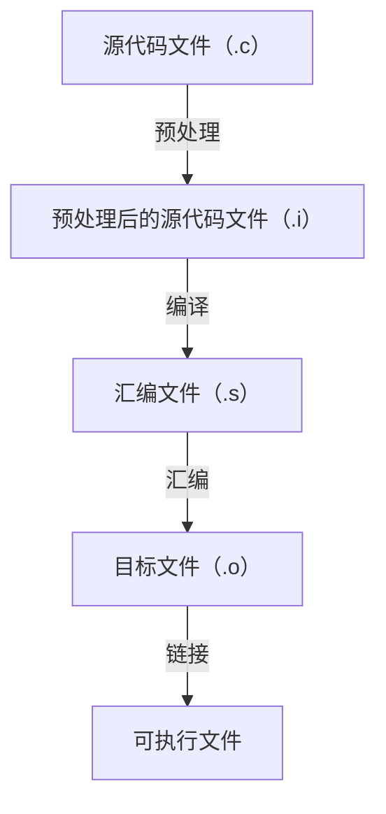

# 附录三 开源工具与 C 语言

前置知识：无

Copyright 2025 OhanaTyan@github

这一讲主要介绍一些 C 语言基础知识，以及相关开源工具的使用。学习这一讲不需要任何 C 语言基础，当然如果你有一定的基础，可以更容易地阅读这一讲，或者可以跳过某些内容。

## 第零讲 C 语言通识

### 1. C 语言大观

C 语言是一门编译型语言。C 语言的代码本身不可执行，它需要被**编译器**编译为可执行文件，这个可执行文件是可以执行的。常用的编译器有`gcc clang msvc`等。

实际上，C 语言的编译可分为四个步骤：**预处理**、**编译**、**汇编**、**链接**。每一个步骤都会生成中间文件，可以在使用`gcc`时使用`-save-temps`选项保留中间文件。



`gcc` 内部**集成**了预处理器、编译器、汇编器、链接器。

通常可认为 C++ 是 C 语言的超集，即任何一段 C 语言代码都可以被当做 C++ 代码。因为 C++ 保留了几乎 C 的全部语法。
> 但其实也有例外。比如 `auto` 关键字在 C 语言中用于声明自动变量（但不常用，因为 C 语言默认函数内除非一个变量被 `static` 标注，否则都是自动变量），而在 C++ 中，`auto` 关键字用于自动推导变量类型。

### 2. 标识符与关键字

标识符可以用作**变量**、**函数**等的名字。当我们想要给一个变量或函数起名的时候，它必须满足 C 语言对于标识符的规定：

- 标识符的第一个字符必须是字母或下划线。
- 标识符的其他字符可以是字母、数字、下划线。

以下是合法的标识符：

```c
my_variable
abc123
_a
```

以下不是合法的标识符：

```c
1abc // 第一个字符不能是数字
my-variable // 不能包含除字母、数字、下划线以外的字符
```

和其他几乎语言一样，C 语言同样有很多**关键字**。关键字不能作为标识符。C 语言中的关键字如下：

- 数据类型：`int`、`float`、`double`、`char`
- 类型修饰符：`short`、`long`、`signed`、`unsigned`、`void`
- 存储类型：`auto`、`register`、`static`
- 外部链接：`extern`、`typedef`
- 控制流：`if`、`else`、`switch`、`case`、`default`、`
- 循环结构：`for`、`while`、`do`、`break`、`continue`
- 跳转语句：`goto`、`return`
- 常量定义：`const`
- 联合体：`union`
- 结构体：`struct`、`enum`
- 位操作：`volatile`
- 大小计算：`sizeof`

### 3. 注释

C 语言的**注释**会在预处理阶段被编译器当做空白字符，所以它们对代码的运行结果不会产生影响。但它们可以方便人们阅读和维护代码。

如果不写注释，或者写下不利于别人（包括未来的自己）理解的注释，会导致项目难以维护。

C 语言的注释有两种形式：

```c
// 这是单行注释
/*
这是多行注释
可以跨越多行
*/
```

一种常见的操作叫做**注释掉**一行代码，即刻意在某一行代码前面加上`//`，这样这一行代码会被编译器当做是注释内容从而使得这一行代码不会被执行。这种技巧常用于调试代码。

## 第一讲 类型与声明

如果你已经学过 C 语言，那么这一讲的内容可以跳过。但其实也推荐一看。

在进行编程时，一定要有这样的观念：一个东西只有被声明过，才可以被使用。下面的内容将详解**类型**、**变量**、**函数**等的声明。

### 1. 基础类型

#### 1. `int` 及其衍生类型

`int` 类型在 C 语言中是一个整型数据类型，可以表示整数。通常 一个`int` 类型的值占用 4 个字节的存储空间。

可以使用 `short`、`long`、`long long` 修饰 `int` 类型，这样它们就变成了 `short int`、`long int`、`long long int`类型。但其实，可以省略掉 `short int`、`long int`、`long long int`的 `int`，也就是只保留 `short`、`long`、`long long` 本身。`short` 与 `short int` 是同一种类型，对于 `long`、`long long` 来说同理。

`short` 类型通常占用 2 字节存储空间；`long` 类型与 `int` 类型相同，占用 4 个字节的存储空间；`long long` 占用 8 个字节存储空间。

`short` 只能表达 `-32768~32767` 范围的数字，如果运算时得到的数字超出了这个返回，会发生**溢出**现象。因为它的范围较小，并且现在已经不需要刻意使用`short`类型节省存储空间，所以`short`类型很不常用。

`int` 的范围是 `-2147483648~2147483647`，也就是 $-2^{31}$ 到 $2^{31}-1$。有时这个范围仍然不够大，那么可以使用 `long long` 类型，范围是 `-9223372036854775808~9223372036854775807`，即 $-2^{63}$ 到 $2^{63}-1$。

然后介绍 `signed` 与 `unsigned` 关键字，这两个关键字都可以用来修饰其他类型。`signed` 关键字表示一个类型是有符号数，即该类型既可以是正数，也可以是负数，也可以是 `0`。上面提到的所有类型默认都是 `signed`类型，即 `int` 类型默认就是 `signed int`，所以这个关键字似乎没什么必要。`unsigned` 关键字用于表示一个类型是无符号数，即只能是正数或者 `0`，不能是负数。

单独的一个 `signed` 和 `unsigned` 如果不修饰其他类型，默认它们是 `signed int` 类型和 `unsigned int` 类型。

`unsigned` 类型其实很不推荐用。比如如果我们让 `2` 和 `3` 相减，那么很容易知道结果是 `-1`。这个结果不会溢出；但如果是无符号数 `2u` 和 `3u` 相减，因为运算结果也应该是无符号数，但 `-1` 并不在无符号数的表达范围内，所以会发生溢出，得出类似于 `4294967295` 的结果。所以，`unsigned` 类型一般用于整数的索引，或者用来表示一个数的位数。

C 语言标准库很喜欢用 `unsigned` 类型。比如标准库中常用的 `size_t` 类型，其实就是 `unsigned long long` 类型的别名。下面的代码来自于 `mingw` 对于 C 语言头文件的实现。

```c
// crtdefs.h
typedef __int64 size_t;
// _mingw.h
#define __int64 long long
```

#### 2. `char` 及其衍生类型

`char` 类型常用于表达 ASCII 字符，它只占用一个字节。它的衍生类型为 `signed char`、`unsigned char`。需要注意的是，`char`、`signed char`、`unsigned char` 这三个两两不同。

#### 3. 浮点数

C 语言的浮点数类型包括 `float`、`double`、`long double`。`float` 类型占用 4 个字节的存储空间，`double` 类型占用 8 个字节的存储空间，`long double` 类型并没有明确规定，且这个类型不常用，但一般比 `double` 长。

`double` 的精度和可以表达数字范围都优于 `float`，因此通常更常用 `double` 类型。

### 2. 函数的声明

函数可以说是 C 语言中一个非常重要的概念。这里介绍函数的声明的语法。

```c
return_type function_name(parameter_list);
// 例子
int main();
void f(int a);
int g(int a, float b);
int h(...);
```

如何描述函数的声明？通常如下描述：
> 上面的代码**声明**了一个函数`main`，它的返回值是`int`类型，没有参数。
> 还声明了一个函数`f`，它没有返回值，有一个参数，类型为`int`。
> 还声明了一个函数`g`，它返回`int`类型，有两个参数，类型分别为`int`和`float`。它的第一个参数类型为`int`，第二个参数类型为`float`。
> 还声明了一个函数`h`，它的返回值是`int`类型，参数个数不确定，参数类型未知。

如果一个函数没有返回值，则认为它返回`void`类型，使用`void`作为返回值类型。

### 3. 数组与指针的声明

> 开始上难度了哦~

C 语言的设计哲学是，期望变量的声明与它的使用看上去相同。于是`int a[10]`这种声明数组的方式与`a[0]`这种使用数组中变量的方式看上去相同。`int *p`这种声明指针的方式与`*p`这种使用指针指向的变量的方式看上去相同。

#### 1. 数组的声明

**数组**的声明语法如下：

```c
type_name array_name[array_size];
// 例子
int a[10];
```

类型描述如下：
> 代码声明了一个`a`数组，该数组有`10`个**元素**，每个元素都是`int`类型。
> 或者可以描述为：`a`是一个有着`10`个元素，每一个元素都是`int`类型的数组。
或者可以描述：
> `a`的类型为 `int[10]`。

数组本身不是变量。例如上面代码中的`a`，其实是一个**常量**。但是数组中的每个元素都是变量。

实际上，可以认为编译器是这样解析 `int a[10];` 这一行代码的。

1. 首先，编译器识别到 `a`，这时编译器只知道有一个标识符名字是 `a`，但是它的类型还没有确定。此时，可以这样描述代码已识别/未识别的内容：`int ^[10];`;
2. 然后向右解析，发现 `[10]`。于是编译器知道 `a` 是一个数组，它有 `10` 个元素，但此时该数组的元素类型暂定。`int ^[10];` 变成了 `int ^;`。
3. 接着向右解析，发现分号，说明分号右面不是与标识符 `a` 相关的内容，于是，
4. 从 `a` 的位置向左解析，发现 `int`，说明(2)中提到的“元素”的类型是 `int` 类型。`int ^;` 变成了 `^;`。
5. 解析结束。

上难度：

```c
int b[5][10];
```

它是个什么类型？

解析过程如下：

1. 识别到 `b` ，这时编译器只知道有一个标识符名字是 `b`，但是它的类型暂定。`int ^[5][10];`
2. 向右识别，发现 `[5]`，这时编译器知道 `b` 是一个数组，该数组有 `5` 个元素，元素类型暂定。`int ^[10];`
3. 接着向右识别，发现 `[10]`，说明(2)中暂定的类型是一个数组，而这个新的数组的元素类型暂定。`int ^;`
4. 识别到分号，向右识别结束，接着向左识别。
5. 识别到 `int`，说明(3)中暂定的“新的数组的元素”的类型是 `int`。`^;`
6. 解析结束。

这里有些绕。我们不妨直接给出`b`的类型：
> `b`是一个数组，它有`5`个元素，每个元素都是一个数组。它的每个元素都是有着`10`个元素，每个元素是`int`类型的数组。

用英文描述可能更方便一些：
> `b` is an array with `5` elements, each element is an array of `10` `int` elements.

或者可以认为，`b` 是一个有着 `5` 个元素的数组，它的每个元素的类型都是 `int[10]`。

再接着上难度：

```c
int d[2][10][3];
```

它的类型描述如下：
> `d`是一个数组，它有两个元素，它的每个元素都是一个数组，这个数组有`10`个元素，每个元素都是一个数组，这个数组有`3`个元素，每个元素的类型都是`int`。

或者描述为
> `d`是一个有着两个元素的数组，它的每个元素的类型都是 `int[10][3]`。
用英文描述如下：
> `d` is an array with `2` elements, each element is an array of `10` arrays, each of these arrays has `3` `int` elements.

#### 2. 指针的声明

语法如下：

```c
type_name *pointer_name;
```

这里的 `type_name` 可以是 `void` 类型。

以下是合法的指针声明。

```c
int* pa;
int *pb;
int** pc;
void *pd;
```

如下描述上述声明：
> `pa` 是一个指针（类型变量），它指向一个 `int` 类型的变量。也可以说 `pa` 是一个 `int *` 类型的变量。
> `pb` 与 `pa` 类型相同。这个例子只是想说明 `*` 的位置对于指针声明没有影响。
> `pc` 是一个指针，它指向一个类型是指针的变量，该指针指向一个 `int` 类型的变量。或者说，`pc` 是一个指针，它指向一个类型是 `int*` 的变量。
> `pd` 是一个类型是 `void *` 的指针

这里把 `void*` 整体当做是一种特殊的类型，而不是认为 `pd` 指向一个类型是 `void` 的变量。

#### 3. 复杂类型的解析

下面给出三个例子：

```c
int *(a[10]);   // 1
int (*a)[10];   // 2
int *a[10];     // 3
```

对于(1)，解析过程如下：

1. 首先识别到标识符 `a`，它的类型暂定。`int *(^[10]);`
2. 向右识别到 `[10]`，说明 `a` 是一个数组，它的元素个数为 `10`，元素类型暂定。`int *(^);`
3. 向右识别到 `)`，说明需要向左识别。
4. 向 `a` 左侧识别，发现 `(`，此时括号内已经识别完毕。`int *^;`
5. 继续向右识别，识别到 `;`，向右识别完毕，继续向左识别。
6. 识别到 `*`，说明(2)中暂定的类型是一个指针，但是该指针指向的元素类型暂定。继续向左识别。`int ^;`
7. 识别到 `int`，说明(6)中暂定的元素类型是 `int`。`^;`
8. 解析结束。

于是得出结论：`a`是一个有十个元素的数组，它的每个元素的类型都是`int*`。

对于(2)，解析过程如下：

1. 首先识别到标识符`a`，它的类型暂定。`int (*^)[10];`
2. 向右识别到 `)`，说明需要向左识别。
3. 向左识别到 `*`，说明(1)中暂定的类型是一个指针，其指向类型暂定。`int (^)[10];`
4. 向左识别到 `(`，此时括号内识别完毕。`int ^[10];`
5. (下略)

于是得出结论：`b`是一个指针，它指向一个数组，该数组有十个元素，每个元素的类型都是`int`。

对于(3)，不给出解析过程，只告诉答案：(3)与(1)类型相同。`*` 和 `[]` 运算符是**右结合**的，这说明当编译器进行识别类型的时候，会先向右识别，再向左识别。于是它会优先认为`a` 是一个数组，而不是一个指针。

再给出一个函数的解析的例子。

```c
int f(int a);
```

1. 首先识别到 `f`，它的类型暂定。`int ^(int a);`
2. 然后向右识别到 `(int a)`，说明 `f` 是一个函数，它有一个参数，类型为 `int`。函数返回值的类型暂定。`int ^;`
3. 然后向右识别到 `;`，说明需要向左识别。
4. 然后向左识别到 `int`，说明(3)中暂定的“函数返回值”的类型为 `int`。`^;`
5. 解析结束

#### 4. 函数指针

函数指针是一种特殊的指针，它指向一个函数。每一个函数其实都有一个内存地址。

函数指针的声明语法如下：

```c
return_type (*function_pointer_name)(parameter_list);
```

这里给出一个例子。下面是 C 语言**标准库**中的 `qsort` 函数的声明，它一共有 4 个参数。其中第四个参数的类型就是一个函数指针。

```c
void qsort(void *base, size_t nitems, size_t size, int (*compar)(const void *, const void *));
```

不妨把这个函数指针单拿出来，看一下编译器是如何识别函数指针的。

1. 首先识别到 `compar`，它的类型暂定。`int (*^)(const void *, const void *);`
2. 向右识别到 `)`，说明需要向左识别。
3. 向左识别到 `*`，说明(1)中暂定的类型是一个指针，其指向类型暂定。`int (^)(const void *, const void *);`
4. 向左识别到 `(`，此时括号内识别完毕。`int ^(const void *, const void *);`
5. 向右识别到 `(const void *, const void *)`，右面的内容是一个**参数列表**，说明`compar`是一个函数指针，它指向一个函数。该函数有两个参数，类型均为`const void *`。该函数的返回值类型暂定。`int ^;`
6. 继续向右识别到 `;`，说明需要向左识别。
7. 向左识别到 `int`，说明(5)中暂定的“函数返回值”的类型为 `int`。`^;`
8. 解析结束。

于是可以得到结论：`compar` 的类型是 `int (*)(const void*, const void *)`。它是一个函数指针，指向这样一个函数，这个函数接受两个类型均为 `const void*` 的参数，返回值类型为 `int`。

### 4. 结构体、共用体与枚举类型

除了上述类型以外，C 语言还支持用户自定义类型。

#### 1. 结构体

结构体的声明语法如下：

```c
struct struct_name{
    type_name member1;
    type_name member2;
   ...
};
```

下面是 `mingw` 对于 C 语言的头文件实现中，对于 `FILE` 类型的定义：

```c
 struct _iobuf {
    char *_ptr;
    int _cnt;
    char *_base;
    int _flag;
    int _file;
    int _charbuf;
    int _bufsiz;
    char *_tmpfname;
  };
  typedef struct _iobuf FILE;
```

可以看到，`FILE` 类型（也就是 `struct _iobuf`）是一个结构体，它有 8 个成员（或者叫做**字段**），每个成员的类型都是 `char*`、`int`、`char*`、`int`、`int`、`char`，名字分别是 `_ptr`、`_cnt`、`_base`、`_flag`、`_file`、`_charbuf`、`_bufsiz`、`_tmpfname`。

当已经声明了一个结构体类型后，可以用该类型来声明变量。

```c
struct __iobuf a;
// 声明了一个类型为 struct __iobuf 的变量 a
FILE* fp;
// 声明了一个类型为 FILE* 的变量 fp
// 该变量指向 FILE 类型
```

#### 2. 共用体

共用体的语法类似于结构体。共用体与结构体的用途截然不同，但这里姑且只介绍它们的语法。

```c
union union_name{
    type_name member1;
    type_name member2;
    ...
};
// 例子，出自苏小红《C语言程序设计 第4版》
union sample{
    short i;
    char ch;
    float f;
};
// 使用 union sample 类型声明变量
union sample s;
```

#### 3. 枚举类型

枚举类型的语法如下：

```c
enum enum_name{
    enum_name1,
    enum_name2,
    ...
};
// 例子
enum response {no, yes, none};
// 使用 enum response 类型声明变量
enum response answer;
```

### 5. `typedef` 关键字的使用

`typedef` 关键字用于给一个类型起一个新的名字。它的语法大致如下：

```c
typedef one_type another_type;
// 例子
typedef int my_int;         // 1
typedef int (*compar)(int, int);  // 2
```

如何理解 `typedef` 关键字？先考虑去掉该关键字看一下。

```c
int my_int;         // 3
int (*compar)(int, int);  // 4
```

其中(3)中的`my_int`的类型是`int`，(4)中的`compar`的类型是`int (*)(int, int)`。那么如果加上 `typedef` 关键字，那么(1) 中的 `my_int` 就变成了 `int` 类型的**别名**。(2)中的 `compar` 就变成了 `int (*)(int, int)` 类型的别名。

于是，只要写了(1)或者(2)代码，那么我们可以如下声明变量：

```c
my_int a;
compar b;
```

这样，变量 `a` 的类型就是 `int`，变量 `b` 的类型就是 `int (*)(int, int)`。

## 第二讲 编译与调试

可算是步入正题了。这一讲开始，将会有动手实践环节。文中会给出实际可执行的代码，并给出相应的命令行操作，同时穿插讲解内容。

### 1. `main` 函数是入口函数

编写 `hello.c` 文件，内容如下：

```c
#include <stdio.h>
#include <stdlib.h>

int f(){
    printf("hello f\n");
    return 0;
}

int main(){
    printf("hello main\n");
    return 0;
}
```

编译为可执行文件：

```bash
gcc hello.c -o hello
```

这里先不执行代码，猜测一下它的运行结果。算了，不卖关子了。结果是：

```bash
$ ./hello
hello main
$
```

可以看到，可执行文件被执行时，先从 `main` 函数开始执行。而 `f` 函数仅仅是因为名字不是 `main`，所以并没有被执行。

### 2. 汇编器、`gdb` 的使用、函数调用

编写 `add.c` 文件：

```c
// add.c
#include <stdio.h>
#include <stdlib.h>

int add(int a, int b){
    int c=a+b;
    return c;
}

int main(){
    printf("%d\n", add(1, 2));
    return 0;
}
```

使用 `gcc` 编译（这里的 `-g` 参数用于方便之后使用 `gdb` 调试）：

```bash
gcc add.c -o add -g -save-temps
```

进入 `add.s` 文件，可以看到 `add` 函数 和 `main` 函数对应的汇编代码。由于操作系统、编译器版本等的不同，生成的汇编代码可能与下文中的示例不同。

```assembly
add:
        pushq   %rbp
        .seh_pushreg    %rbp
        movq    %rsp, %rbp
        .seh_setframe   %rbp, 0
        subq    $16, %rsp
        .seh_stackalloc 16
        .seh_endprologue
        movl    %ecx, 16(%rbp)
        movl    %edx, 24(%rbp)
        movl    16(%rbp), %edx
        movl    24(%rbp), %eax
        addl    %edx, %eax
        movl    %eax, -4(%rbp)
        movl    -4(%rbp), %eax
        addq    $16, %rsp
        popq    %rbp
        ret
        .seh_endproc
        .def    __main; .scl    2;      .type   32;     .endef
        .section .rdata,"dr"

main:
        pushq   %rbp
        .seh_pushreg    %rbp
        movq    %rsp, %rbp
        .seh_setframe   %rbp, 0
        subq    $32, %rsp
        .seh_stackalloc 32
        .seh_endprologue
        call    __main
        movl    $2, %edx
        movl    $1, %ecx
        call    add
        movl    %eax, %edx
        leaq    .LC0(%rip), %rcx
        call    printf
        movl    $0, %eax
        addq    $32, %rsp
        popq    %rbp
        ret
```

CPU 只能理解**机器指令**。它只会机械地按照一定的次序执行机器指令。每一条汇编指令**严格对应**着对应的机器指令。所以我们有时会把它们混为一谈。

使用 `gdb` 运行可执行文件。

```bash
$ gdb add
GNU gdb (GDB) 8.1
（中略）
Reading symbols from add...done.
(gdb) display /i $pc 
1: x/i $pc
<error: No registers.>
(gdb) b main
Breakpoint 1 at 0x40157f 
(gdb) b add
Breakpoint 2 at 0x401558
(gdb)
```

上面的命令 `b main` 在 `main` 函数处打了一个**断点**，这样每次运行到 `main` 函数时，`gdb` 都会停下来等着你输入命令。`display /i $pc` 命令用于显示当前指令地址的汇编代码。

然后输入 `r`，运行程序：

```bash
(gdb) r
Starting program: /home/user/add 
[New Thread 8292.0x4c54]
[New Thread 8292.0x7b3c]

Thread 1 hit Breakpoint 1, 0x000000000040157f in main ()
1: x/i $pc
=> 0x40157f <main+13>:  mov    $0x2,%edxBreakpoint 1, main () at add.c:10
(gdb)  
```

程序运行后，果然在断点处停了下来。接下来输入 `ni`，它的作用是单步执行一条汇编指令。

```bash
(gdb) ni
0x0000000000401584 in main ()
1: x/i $pc
=> 0x401584 <main+18>:  mov    $0x1,%ecx
(gdb)
0x0000000000401589 in main ()
1: x/i $pc
=> 0x401589 <main+23>:  callq  0x401550 <add>
(gdb)
```

这里可以看到，`mov $0x1, %ecx$` 汇编代码与上文中 `add.s` 中的`movl $0x1, %ecx` 代码相对应。`callq 0x401550 <add>` 对应着 `call add` 指令。
> 一些汇编指令有**别名**，但他们都对应着同一条机器指令。

这里着重讲一下 `call` 指令，它用于**调用**一个函数。然后接着使用 `ni` 单步执行汇编代码，可以看到程序接下来执行 `add` 函数的汇编指令。

```bash
(gdb) ni
Thread 1 hit Breakpoint 2, 0x0000000000401558 in add ()
1: x/i $pc
=> 0x401558 <add+8>:    mov    %ecx,0x10(%rbp)
(gdb)
0x000000000040155b in add ()
1: x/i $pc
=> 0x40155b <add+11>:   mov    %edx,0x18(%rbp)
(gdb)
0x000000000040155e in add ()
1: x/i $pc
=> 0x40155e <add+14>:   mov    0x10(%rbp),%edx
(gdb)
0x0000000000401561 in add ()
1: x/i $pc
=> 0x401561 <add+17>:   mov    0x18(%rbp),%eax
(gdb)
0x0000000000401564 in add ()
1: x/i $pc
=> 0x401564 <add+20>:   add    %edx,%eax
(gdb)
0x0000000000401566 in add ()
1: x/i $pc
=> 0x401566 <add+22>:   mov    %eax,-0x4(%rbp)
(gdb)
0x0000000000401569 in add ()
1: x/i $pc
=> 0x401569 <add+25>:   mov    -0x4(%rbp),%eax
(gdb)
0x000000000040156c in add ()
1: x/i $pc
=> 0x40156c <add+28>:   add    $0x10,%rsp
(gdb)
0x0000000000401570 in add ()
1: x/i $pc
=> 0x401570 <add+32>:   pop    %rbp
(gdb)
0x0000000000401571 in add ()
1: x/i $pc
=> 0x401571 <add+33>:   retq
(gdb)
```

可以看到这里的每一条汇编都与上文中的 `add.s` 中的汇编代码有对应关系。
> 可能有人会不理解为什么 `add.s` 中的数字 `16` 对应着 `0x10`。其实这是十进制与十六进制的原因。`0x` 开头的数字是十六进制数字，在十六进制的规则下，十进制中的 `16` 和十六进制的 `0x10` 是同一个数字。

这里再着重讲一下 `ret` 指令，它用于**返回当前函数**，对应着 C 语言的 `return` 语句。

`main` 函数执行 `call add` 调用 `add` 函数后，可以理解为 `main` 函数的执行被暂停，先执行 `add` 函数的汇编代码。`add` 函数执行 `ret` 指令后，`ret` 函数执行结束，程序返回到 `main` 函数的汇编代码，并且刚好返回到 `main` 函数调用 `add` 函数 `call add` 的下一条汇编代码。

```bash
(gdb) ni
0x000000000040158e in main ()
1: x/i $pc
=> 0x40158e <main+28>:  mov    %eax,%edx
(gdb)
0x0000000000401590 in main ()
1: x/i $pc
=> 0x401590 <main+30>:  lea    0x2a69(%rip),%rcx        # 0x404000
(gdb)
0x0000000000401597 in main ()
1: x/i $pc
=> 0x401597 <main+37>:  callq  0x402a90 <printf>
(gdb)
0x000000000040159c in main ()
1: x/i $pc
=> 0x40159c <main+42>:  mov    $0x0,%eax
(gdb)
0x00000000004015a1 in main ()
1: x/i $pc
=> 0x4015a1 <main+47>:  add    $0x20,%rsp
(gdb)
0x00000000004015a5 in main ()
1: x/i $pc
=> 0x4015a5 <main+51>:  pop    %rbp
(gdb)
0x00000000004015a6 in main ()
1: x/i $pc
=> 0x4015a6 <main+52>:  retq
(gdb)
```

使用 `q` 可以退出 `gdb` 调试器。

```bash
(gdb) q
A debugging session is active.
    Inferior 1 [process 30324] will be killed
Quit anyway? (y or n) y
$ 
```

### 3. 链接器、`objdump` 的使用、常见编译错误

这一小节的其中一个内容是，将常见的编译错误都踩一遍。

使用 `rm add.*` 删除掉与 `add` 相关的所有内容，重新编写三个文件：

```c
// add.h
int add(int a, int b);

// add.c
#include "add.h" 
// 这里讲一下引用头文件时， <> 和 "" 的区别。
// <> 表示在编译时在系统目录中搜索该文件，"" 表示在当前目录下搜索该文件

int add(int a, int b){
    int c=a+b;
    return c;
}

// main.c
#include <stdio.h>
#include <stdlib.h>

int main(){
    printf("%d\n", add(1, 2));
    return 0;
}
```

使用 `gcc` 编译 `main.c`：

```bash
$ gcc main.c -c
main.c: In function 'main':
main.c:5:17: warning: implicit declaration of function 'add'; did you mean 'rand'? [-Wimplicit-function-declaration]
  printf("%d\n", add(1, 2));
                 ^~~
                 rand
$
```

可以看到，`gcc` 之所以报错，是因为 `main` 函数调用 `add` 函数时，`add` 函数没有声明。所以需要引用 `add.h` 头文件，使得 `add` 函数的声明被包含进来。

```c
// main.c
#include <stdio.h>
#include <stdlib.h>

#include "add.h"

int main(){
    printf("%d\n", add(1, 2));
    return 0;
}
```

然后重新编译：

```bash
gcc main.c add.c -c -save-temps
```

可以看到编译器生成了 `main.o` 和 `add.o` 两个目标文件，同时可以看到 `main.s` 和 `add.s` 两个汇编文件。查看 `main.s` 文件，可以看到 `main` 函数想要调用 `add` 函数，但 `main.s` 文件中并没有 `add` 函数的汇编代码。

使用 `objdump` 查看 `main.o` 的**反汇编**代码。

```bash
$ objdump main.o -d

main.o:     file format pe-x86-64


Disassembly of section .text:

0000000000000000 <main>:
   0:   55                      push   %rbp
   1:   48 89 e5                mov    %rsp,%rbp
   4:   48 83 ec 20             sub    $0x20,%rsp
   8:   e8 00 00 00 00          callq  d <main+0xd>
   d:   ba 02 00 00 00          mov    $0x2,%edx
  12:   b9 01 00 00 00          mov    $0x1,%ecx
  17:   e8 00 00 00 00          callq  1c <main+0x1c>
  1c:   89 c2                   mov    %eax,%edx
  1e:   48 8d 0d 00 00 00 00    lea    0x0(%rip),%rcx        # 25 <main+0x25>
  25:   e8 00 00 00 00          callq  2a <main+0x2a>
  2a:   b8 00 00 00 00          mov    $0x0,%eax
  2f:   48 83 c4 20             add    $0x20,%rsp
  33:   5d                      pop    %rbp
  34:   c3                      retq
  35:   90                      nop
  36:   90                      nop
```

可以看到 `main.o` 文件中不包含 `add` 函数的实现。再使用 `objdump` 查看 `add.o` 的反汇编代码。

```bash
$ objdump add.o -d

add.o:     file format pe-x86-64


Disassembly of section .text:

0000000000000000 <add>:
   0:   55                      push   %rbp
   1:   48 89 e5                mov    %rsp,%rbp
   4:   48 83 ec 10             sub    $0x10,%rsp
   8:   89 4d 10                mov    %ecx,0x10(%rbp)
   b:   89 55 18                mov    %edx,0x18(%rbp)
   e:   8b 55 10                mov    0x10(%rbp),%edx
  11:   8b 45 18                mov    0x18(%rbp),%eax
  14:   01 d0                   add    %edx,%eax
  16:   89 45 fc                mov    %eax,-0x4(%rbp)
  19:   8b 45 fc                mov    -0x4(%rbp),%eax
  1c:   48 83 c4 10             add    $0x10,%rsp
  20:   5d                      pop    %rbp
  21:   c3                      retq
  22:   90                      nop
```

可以看到，`add.o` 文件中包含 `add` 函数的实现。然后使用 `gcc` 链接 `main.o` 和 `add.o` 两个目标文件，生成可执行文件 `a.out`。

```bash
$ gcc main.o add.o -o a.out
$ ./a.out
3
$
```

使用 `objdump` 查看 `a.out` 的反汇编代码，可以看到 `a.out` 中同时包含了 `main` 函数与 `add` 函数的实现（执行结果略）。

下面试一下这些常见错误：

```bash
$ gcc main.o -o a.out
main.o:main.c:(.text+0x18): undefined reference to `add'
collect2.exe: error: ld returned 1 exit status
（报错原因：找不到 add 函数的实现）
$ cp add.c add1.c
$ gcc add.c add1.c -c
$ gcc main.o add.o add1.o -o a.out
add1.o:add1.c:(.text+0x0): multiple definition of `add'
add.o:add.c:(.text+0x0): first defined here
collect2.exe: error: ld returned 1 exit status
（报错原因：存在多个 add 函数的实现）
$
```

C++ 的 `inline` 关键字有如下作用：如果在链接时遇到多个同一函数的实现，则只保留其中一份。

问题来了：既然我们根本没有实现过 `printf` 函数，那么为什么可以直接调用它？其实，`printf` 函数实现是由标准库提供的，例如对于一些 Linux 系统来说，这个函数的实现在系统自带的 `libc.a` 库中。

### 4. 预处理

#### 1. 宏

可以使用 `#define` 指令定义宏，宏可以用来简化代码，提高代码的可读性。定义宏的语法如下：

```c
#define MACRO_NAME replacement_text
#define MACRO_NAME(parameter_list) replacement_text
// 例子
#define PI 3.1415926
#define SQUARE(x) ((x)*(x))
```

预处理时，宏会被替换为对应的 `replacement_text`。

```c
// 替换前
printf("%f\n", PI);
// 替换后
printf("%f\n", 3.1415926);
// 替换前
int y=SQUARE(x);
// 替换后
int y=(x)*(x);
```

由于宏的替换非常简单粗暴，所以不恰当使用宏，可能会导致未知的后果。

```c
#define ADD(a, b) a+b
// 替换前
int c = ADD(1, 2)*3; // 期望结果： 9
// 替换后
int c = 1+2*3; // 结果替换后的结果竟然是 7
// 所以似乎加上括号可能会管用，但是
#define SQUARE(x) ((x)*(x))
// 替换前
int y = SQUARE(f());
// 本来期望 f 函数只被调用一次
// 替换后
int y = (f())*(f()); 
// 结果替换后 f 函数被调用两次
```

`#undef` 可以取消定义一个宏。

#### 2. 宏编程

如果查看一些较为早期的 C 语言代码，那么可能会经常看到大量花哨的宏编程技术，这里姑且写一个。

```c
#include <stdio.h>
#include <stdlib.h>

#define A4(F, n) F(n); F(n+1); F(n+2); F(n+3);
#define A16(F, n) A4(F, n); A4(F, n+4); A4(F, n+8); A4(F, n+12);
#define A64(F, n) A16(F, n); A16(F, n+16); A16(F, n+32); A16(F, n+48);
#define A256(F, n) A64(F, n); A64(F, n+64); A64(F, n+128); A64(F, n+192);
#define A1024(F, n) A256(F, n); A256(F, n+256); A256(F, n+512); A256(F, n+768);

#define PRINT(n) printf("%d\n", n);

int main(){
    A1024(PRINT, 1);
    return 0;
}
```

可以试着执行一下这段代码，看看会输出什么。

宏编程其实和模板元编程一样处于较为尴尬的境地。一方面，使用宏编程或者模板元编程的代码难以阅读和调试。但另一方面，宏编程也有其自身的优点，例如可以实现一些复杂的逻辑，或者可以简化代码。

#### 3. 预定义宏

C/C++ 中有大量的预定义宏，常见的预定义宏如下：

- `__FILE__`：当前源文件名
- `__LINE__`: 当前源代码行号
- `__DATE__`：编译日期
- `__TIME__`：编译时间
- `__STDC__`：是否使用标准C
- `__STDC_VERSION__`：C语言的版本
- `__FUNCTION__`：当前函数名

这些宏可以帮助我们更加方便地编写代码。之前提到，常见的编译器有 `gcc`、`clang`、`msvc` 等，不同编译器可能提供不同的预定义宏。
> 经常出现的一个问题是，有时你根本不知道使用你的代码的人是使用什么编译器编译，所以不得不为所有可能的编译器都写一份代码。

有一个术语叫做**开洞**，指的是编译器额外提供一些 C 语言标准中并没有规定的功能。比如，有的编译器可能提供 `__COUNTER__` 这个宏，它可以帮助我们生成一个唯一的标识符。

还有一些预定义宏可以帮助我们根据平台选择性地编译代码。

```c
#ifdef _WIN32
    printf("Windows平台\n");
#elif defined(__linux__)
    printf("Linux平台\n");
#elif defined(__APPLE__)
    printf("macOS平台\n");
#else
    printf("未知平台\n");
#endif
```

#### 4. 条件编译

上一节中出现的 `#if`、`#elif`、`#else` 等是用于条件编译的预处理指令。条件编译可以根据条件选择性地编译代码。`#if` 和 `#elif` 后面可以接和宏相关的布尔表达式。

下面给出一个与`#ifdef`相关的代码。

```c
// macro.c
#include <stdio.h>

int main(){
#ifdef HELLO
    printf("HELLO defined!\n");
    printf("HELLO = %d\n", HELLO);
#else
    printf("HELLO not defined!\n");
#endif
    return 0;
}
// 如果宏 HELLO 被定义，则预处理后
int main(){
    printf("HELLO defined!\n");
    printf("HELLO = %d\n", 1); // 这里假定 HELLO 的值为 1
    return 0;
}

// 如果宏 HELLO 没有被定义，则与处理后
int main(){
    printf("HELLO not defined!\n");
    return 0;
}
```

在使用 `gcc` 进行编译时，可以使用 `-D` 选项定义宏，示例如下。

```bash
$ gcc macro1.c -o main
$ ./main
HELLO not defined!
$ gcc macro1.c -DHELLO -o main
$ ./main
HELLO defined!
HELLO = 1
$ gcc macro1.c -DHELLO=123 -o main
$ ./main
HELLO defined!
HELLO = 123
$
```

通常为了防止一个头文件被引用两次，可以采取如下方式：

```c
// a.h
#ifndef A_H
#define A_H

// 头文件内容

#endif
```

这样，在这个头文件被第一次引用的时候，由于宏 `A_H` 并没有被定义，所以 `#ifndef A_H` 为真，头文件内容会被引用，且宏 `A_H` 会被定义。当该头文件第二次被引用时，由于宏 `A_H` 已经被定义，所以 `#ifndef A_H` 为假，不会再引用头文件内容。

### 5. 优化

先查看 `add.s` 文件（假定你还没有删除这些文件），可以看到里面的汇编指令较多。之所以指令较多，是因为 `add` 函数中需要存储和写入变量 `c`。

```assembly
add:
        pushq   %rbp
        .seh_pushreg    %rbp
        movq    %rsp, %rbp
        .seh_setframe   %rbp, 0
        subq    $16, %rsp
        .seh_stackalloc 16
        .seh_endprologue
        movl    %ecx, 16(%rbp)
        movl    %edx, 24(%rbp)
        movl    16(%rbp), %edx
        movl    24(%rbp), %eax
        addl    %edx, %eax
        movl    %eax, -4(%rbp)
        movl    -4(%rbp), %eax
        addq    $16, %rsp
        popq    %rbp
        ret
```

我们重新查看 `add.c` 代码，可以发现，变量 `c` 是一个完全不需要的变量。

```c
int add(int a, int b){
        int c=a+b;
        return c;
}
```

所以如果调试过程中不需要查看变量 `c` 的值，那么其实它可以被**优化**掉。

编译器可以自动帮我们完成这一项工作。可以使用参数 `-O` 来指定优化级别。`-O1` 表示优化级别 1，`-O2` 表示优化级别 2，`-O3` 表示优化级别 3。其中，数字越大，优化级别越高。但有时 `-O3` 可能会进行过于激进的优化，以至于代码的执行结果不符合预期，尽管它也很常用。经常使用优化级别 `-O2`。

```bash
$ gcc add.c -c -O2
$ objdump add.o -d

add.o:     file format pe-x86-64


Disassembly of section .text:

0000000000000000 <add>:
   0:   8d 04 11                lea    (%rcx,%rdx,1),%eax
   3:   c3                      retq
   4:   90                      nop
$ 
```

可以看到，优化后，`add` 函数甚至只使用两条指令就完成了函数实现。
> `nop` 指令是一条空指令，它的作用是使得编译器产生的汇编代码更加整齐。

需要注意的是，优化与 `-g` 参数冲突。编译器进行优化后，可能使得一些中间变量的值不可见。


## 第三讲 未完

我自己不一定续了。但允许其他人按照这篇文章的思路续写下去，不用和我说。--@OhanaTyan

参考思路：

```c
第三章 高阶调试技巧
第四章 

```
